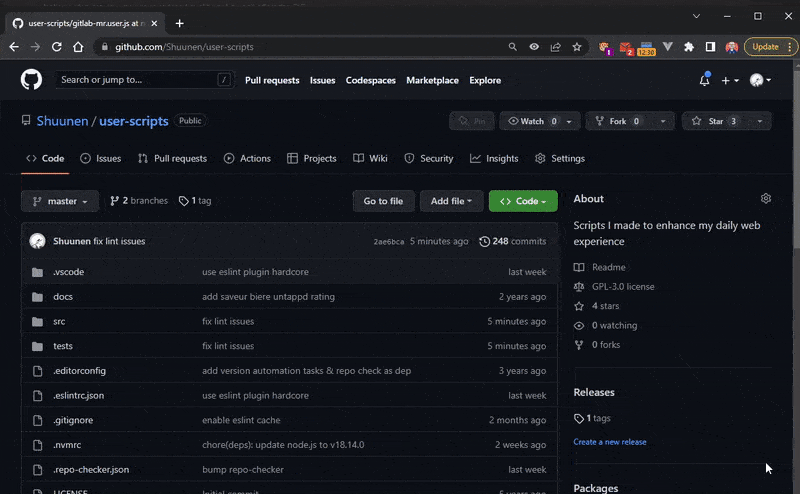
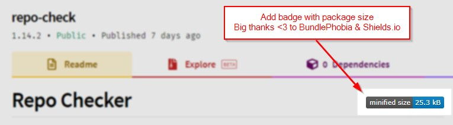
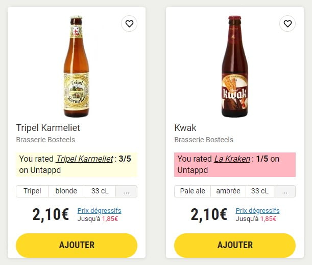

# User Scripts

> Personal heavily opinionated script I make to enhance my daily web experience.

## Usage

1. Make sure you have [ViolentMonkey](https://violentmonkey.github.io) installed
2. Open the script you want to use (use raw view)
3. Review the code, no one should trust a random script from the internet
4. Install the script in your browser

## Scripts

### Amazon - Clearer

### Amazon - Hide products by keywords

### BundlePhobia <3 Everywhere

Works on Github & Npmjs.org for now.

### Saveur Bière - Untappd Ratings

Fetch your own beer ratings from Untappd and inject them in the search results to facilitate orders.

## Todo

- [ ] check/comment the disabled rules in `.eslintrc.js`
- [ ] remove all `// @ts-nocheck`

## Thanks

- [Eslint](https://eslint.org) : super tool to find & fix problems
- [Github](https://github.com) : for all their great work year after year, pushing OSS forward
- [Repo-checker](https://github.com/Shuunen/repo-checker) : eslint cover /src code and this tool the rest ^^
- [Shields.io](https://shields.io) : for the nice badges on top of this readme
- [Shuutils](https://github.com/Shuunen/shuutils) : collection of pure JS utils
- [TailwindCss](https://tailwindcss.com) : awesome lib to produce maintainable style
- [Vitest](https://github.com/vitest-dev/vitest) : super fast vite-native testing framework
